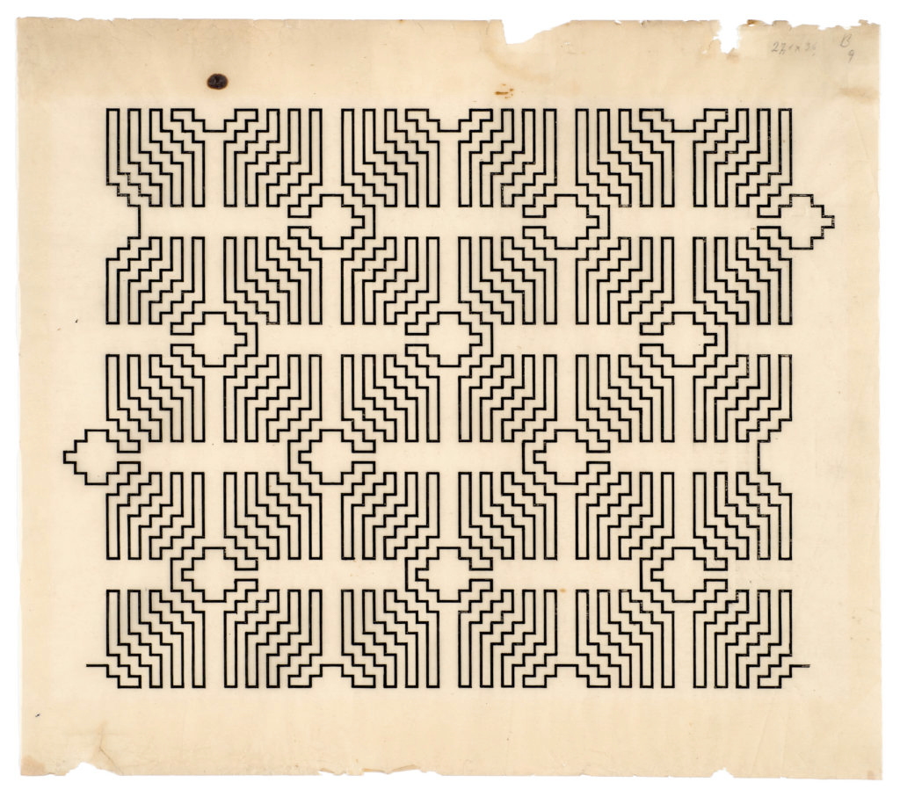
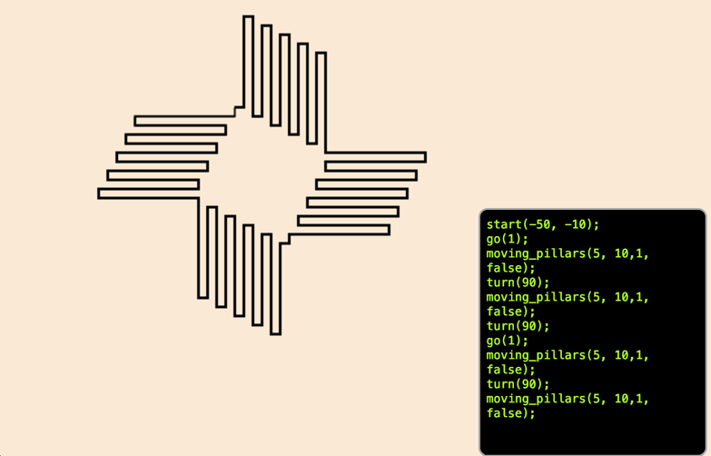

__Szpakowski__

An algorithmic tribute to the Polish artist [Wacław Szpakowski](https://de.wikipedia.org/wiki/Wac%C5%82aw_Szpakowski)

 

at this moment still work in progress...

What is it?
* Think _Logo_, the 'turtle' language from the eighties.
* Because Szpakowski's drawings all follow the principle of the single line.
* it has the basic commands to move the turtle:
- start(x,y)
- go(distance)
- left(degrees)
- right(degrees)

* on top of that it has:
- pillars(number, length, shift, direction=DOWN): the turtle follows a pillary pattern
  - number: the number of pillars (running back and forth)
  - length: the distance per run
  - shift: in-/decrease in length
  - direction: UO|DOWN|BOTH
- moving_pillars(n, length, shift=0, direction=DOWN): the pillars move
  - number: the number of pillars (running back and forth)
  - length: the distance per run
  - shift: shift per run
  - direction: UP|DOWN
- staircase(number, size, direction = DOWN)
  - number: the number of steps
  - size: the step size
  - direction: UP|DOWN

... more functions will follow

### Run
* npm run start

* the console has code completion, but right now it's limited: only once there is only 1 alternative,
you can press tab to complete.
* the interpreter is based on 'Lox' from the 'Crafting Interpreters' book.
* use `var` to declare a variable
* `print(...)` prints to the console
* statements must end with ';' (//TODO remove)
* not yet:
  * loops
  * branching

